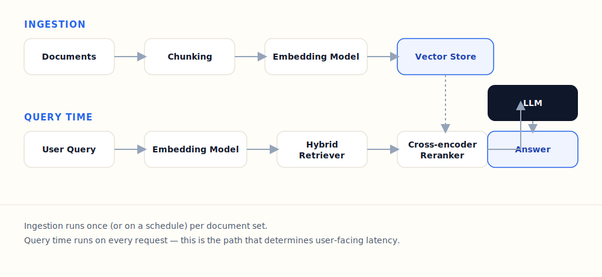
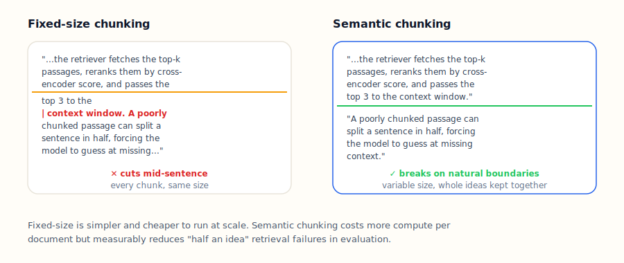
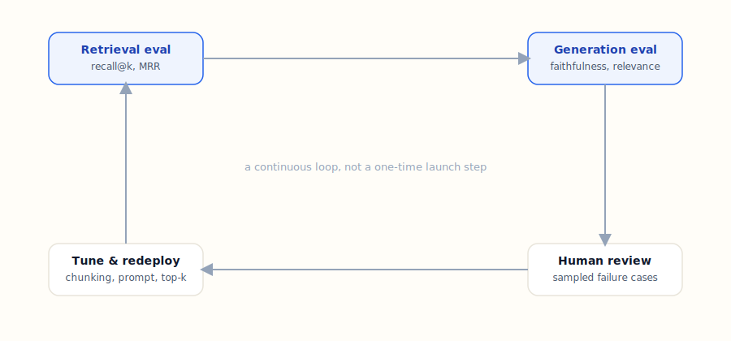

A production RAG pipeline is really two separate pipelines wearing one name: an **ingestion path** that runs
once (or on a schedule) per document, and a **query path** that runs on every single request. Confusing the
two is the most common reason a RAG system that looks fine in a demo falls over in production — the ingestion
path can be as slow and expensive as you like, but the query path is what your users actually feel.

<Callout type="info" title="What this covers">
  The end-to-end architecture, why chunking strategy matters more than model choice for most failures, and the
  evaluation loop that should run continuously, not just before launch.
</Callout>

## The two paths, side by side

**Ingestion** takes raw documents, splits them into chunks, embeds each chunk, and writes the vectors to a
store. Nothing here is latency-sensitive — you can batch it, retry it, and run it overnight.

**Query time** takes a user's question, embeds it with the same model, retrieves candidate chunks, reranks
them, and hands the survivors to an LLM along with the original question. Every stage here adds to the time a
user waits for an answer, which is why the retrieval and reranking steps need to be fast, not just accurate.

If you're new to the retrieval side of this, my earlier post on [Graph-RAG vs. vector RAG](/blog/graph-rag-vs-vector-rag/)
covers when to add graph structure on top of this same query path.

## Chunking is where most retrieval failures actually come from

Model upgrades get the attention, but in practice, most "the RAG system gave a wrong answer" bugs I've debugged
trace back to chunking, not the LLM.

Fixed-size chunking (split every N tokens, regardless of what's there) is simple and cheap, but it will
routinely cut a sentence — or an entire idea — in half. When that half-chunk gets retrieved on its own, the
model has to guess at context it was never given. Semantic chunking (split on paragraph or section boundaries)
costs more to compute up front but keeps ideas intact, which measurably reduces this specific failure mode in
evaluation.

Neither is universally "correct" — it's a real trade-off:

| | Fixed-size | Semantic |
|---|---|---|
| Compute cost | Low | Higher (needs a boundary-detection pass) |
| Implementation complexity | Trivial | Moderate |
| Mid-idea splits | Common | Rare |
| Best for | High document volume, cost-sensitive | Accuracy-sensitive, lower volume |

## Evaluation is a loop, not a launch checklist

The pipeline diagram above ends at "Answer," but a production system doesn't actually end there — it feeds
back into itself.

Two evaluation layers run in parallel:

- **Retrieval evaluation** — did the retriever surface the right chunks at all? Measured with recall@k and
  mean reciprocal rank against a labeled query set.
- **Generation evaluation** — given the retrieved chunks, did the model produce a faithful, relevant answer?
  This is where hallucination and irrelevance get caught.

Sampled failures from both go to human review, which feeds back into concrete changes — chunk size, prompt
wording, or how many candidates the retriever surfaces before reranking — and the loop runs again. Treating
this as a one-time pre-launch checklist is how a RAG system that scored well in testing quietly degrades as
your document set grows and drifts from what it was tuned on.

## Takeaway

If your RAG system is misbehaving, check chunking before you reach for a bigger model — it's cheaper to fix
and it's usually the actual cause. And once it's live, keep the evaluation loop running; a RAG pipeline is a
system you maintain, not a feature you ship once.

For more on the tool-calling side of agentic systems that often sit downstream of a retriever like this, see
[What is MCP, and why every AI engineer should care](/blog/what-is-mcp/).
